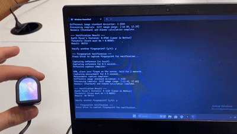

# Tactile Fingerprint Recognition System

**High-Resolution Fingerprint Recognition Using Photometric Stereo and DIGIT Sensor**

This repository contains a complete implementation of a tactile fingerprint recognition system that uses **photometric stereo** techniques with Meta's **DIGIT sensor** to capture and analyze high-resolution fingerprint surface data for biometric authentication.

---

## Functionality
#### Placing the correct finger

#### Placing the incorrect finger

#### Not placing any finger

---

## Overview

This project implements a sophisticated fingerprint recognition pipeline that leverages tactile sensing technology to capture detailed surface topology of fingerprints. The system uses photometric stereo reconstruction to generate surface normals, albedo maps, and height maps from tactile sensor data, enabling robust biometric authentication.

Key components:
- **Photometric stereo reconstruction** for surface analysis
- **DIGIT sensor integration** for high-resolution tactile capture
- **PCA-based feature extraction** for dimensionality reduction
- **Earth Mover's Distance (EMD)** for robust fingerprint matching
- **Real-time capture and processing** with quality assessment
- **Surface roughness analysis** for additional biometric features

---

## Repository Structure

```
ckks-biometric-model/
├── photometric_stereo.py      # Core photometric stereo processing pipeline
├── secure_enroll_and_verify.py # Fingerprint enrollment and verification system
├── pca_model.joblib          # Pre-trained PCA model for feature extraction
├── data/                     # Storage for captured and processed data
└── README.md
```

---

## Requirements

- Python 3.8+
- OpenCV (cv2)
- NumPy
- SciPy
- scikit-learn (joblib)
- Matplotlib
- Meta DIGIT sensor
- `digit` library for sensor communication

Install dependencies:

```bash
pip install opencv-python numpy scipy scikit-learn matplotlib
# Install DIGIT sensor library according to Meta's documentation
```

---

## System Pipeline

1. **Reference Capture**: Capture baseline images with no finger contact
2. **Measurement Capture**: Capture images with finger placed on sensor
3. **Photometric Processing**: Calculate surface normals and albedo using photometric stereo
4. **Feature Extraction**: Apply PCA to reduce dimensionality of albedo maps
5. **Enrollment**: Build user template from multiple high-quality captures
6. **Verification**: Compare probe fingerprint against enrolled template using EMD

---

## Quick Start

### Basic Photometric Stereo Processing

```python
from photometric_stereo import PhotometricStereo

# Initialize the photometric stereo system
ps = PhotometricStereo(camera_index=1, display=True)

# Run interactive processing
ps.run()
```

### Fingerprint Enrollment and Verification

```python
from secure_enroll_and_verify import FingerprintVerifier

# Initialize the verification system
verifier = FingerprintVerifier()

# Run enrollment and verification
verifier.run()
```

---

## Usage Instructions

### Photometric Stereo Interface

The photometric stereo system provides an interactive interface with the following controls:

- **SPACE**: Run full baseline pipeline (capture, process, calculate normals/albedo, height maps)
- **r/R**: Capture reference (1s/5s duration)
- **m/M**: Capture measurement (1s/5s duration)
- **p**: Process captures to generate difference image
- **n**: Calculate surface normals and albedo (standard)
- **h**: Calculate L2 height map from current normals
- **E**: Calculate L2 height map from bilaterally filtered normals
- **1/2/3**: Calculate roughness statistics from different maps
- **S**: Save all generated maps and statistics
- **q**: Quit

### Fingerprint Verification System

The verification system automatically:

1. **Enrollment Phase**: Captures 5 high-quality fingerprint samples
2. **Template Generation**: Creates statistical model of user's fingerprint features
3. **Verification Phase**: Compares new fingerprint captures against enrolled template
4. **Quality Control**: Rejects blurry images or captures without finger presence

---

## Technical Details

### Photometric Stereo Algorithm

The system uses a three-light photometric stereo setup with the DIGIT sensor's built-in LED configuration:

- **Light directions**: Fixed at 0°, 120°, and 240° around the sensor
- **Surface normal calculation**: Solves the photometric stereo equation using least squares
- **Albedo extraction**: Computes surface reflectance properties
- **Height reconstruction**: Integrates surface gradients using Fourier methods

### Feature Extraction

- **PCA dimensionality reduction**: Reduces 8100-dimensional albedo maps to manageable feature vectors
- **CLAHE enhancement**: Improves contrast of albedo maps for better feature extraction
- **Quality assessment**: Uses Laplacian variance for sharpness measurement

### Matching Algorithm

- **Earth Mover's Distance**: Robust distance metric for comparing feature distributions
- **Dynamic thresholding**: Adapts match threshold based on enrollment sample variance
- **Statistical validation**: Uses mean + 2σ approach for reliable authentication

---

## Hardware Requirements

- **DIGIT Sensor**: Meta's high-resolution tactile sensor
- **USB Connection**: For sensor communication
- **Adequate Lighting**: Controlled environment for consistent captures
- **Windows/Linux**: Compatible with both operating systems

---

## Acknowledgments

- **Meta AI**: DIGIT tactile sensor technology
- **Photometric Stereo**: Classical computer vision techniques
- **scikit-learn**: PCA implementation and model persistence
